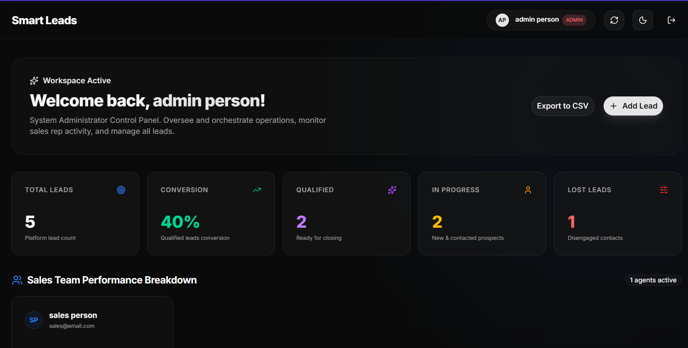
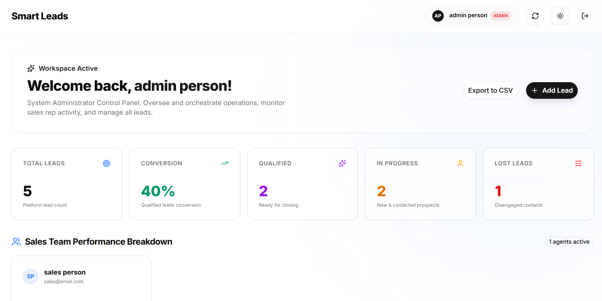
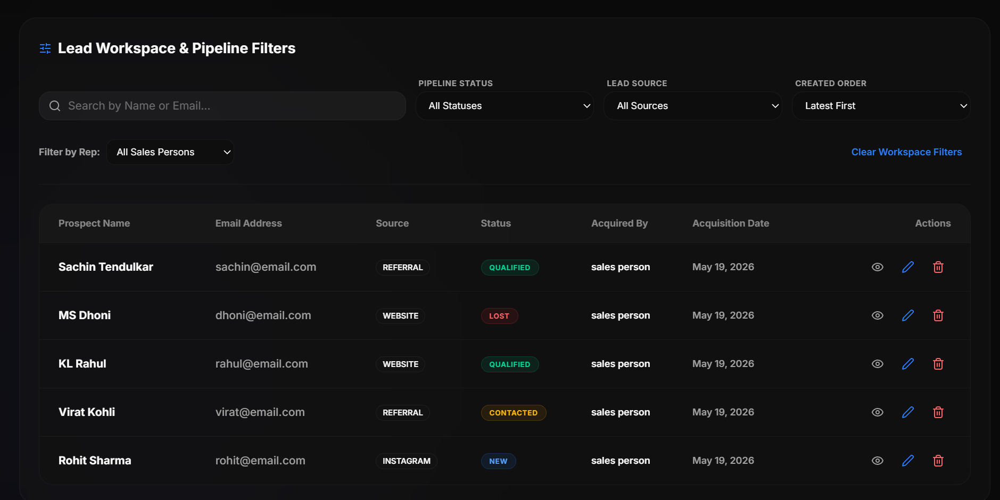
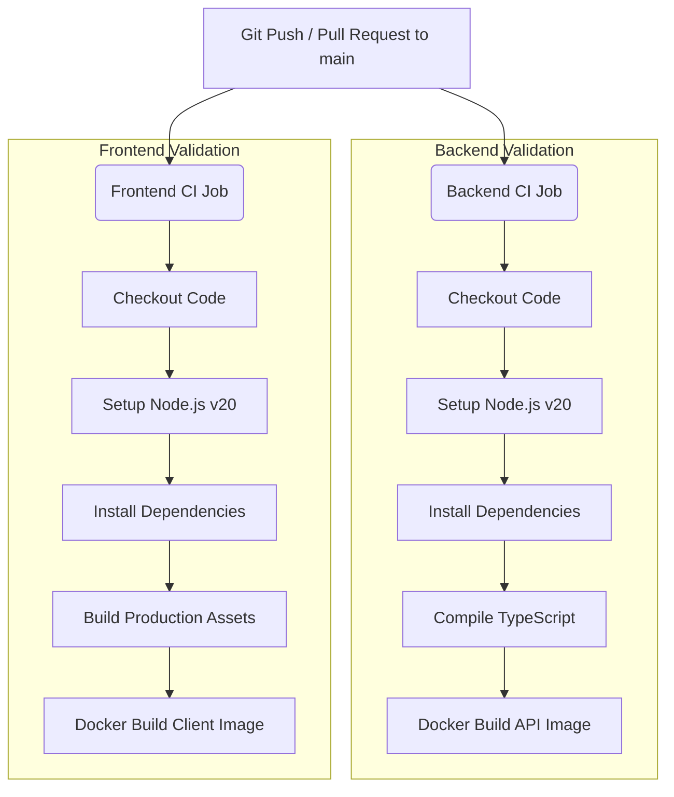

# Smart Leads Management System

[](https://github.com/JeetDas5/smart-leads-management/actions/workflows/ci.yml)
[](https://leads.jeetdas.site)
[](https://react.dev)
[](https://www.typescriptlang.org)
[](https://vite.dev)
[](https://tailwindcss.com)
[](https://bun.sh)
[](https://www.docker.com)


A premium, state-of-the-art Smart Leads Management System designed for high-performance sales teams. This platform enables seamless organization of customer leads, rich analytics visualizations, and secure role-based access. Featuring a gorgeous modern interface with glassmorphism, responsive dashboards, instant debounced searching, and containerized Docker support.

---

## Live Deployment

*   **Production App URL:** [https://leads.jeetdas.site](https://leads.jeetdas.site)
*   **Demo Credentials:**
    *   **Admin Access:** `admin@email.com` / `admin123`
    *   **Sales Access:** `sales@email.com` / `sales123`

---

## Application Screenshots

### Dark Mode Dashboard


### Light Mode Dashboard


### Interactive Leads Table


---

## Key Features

*   **Lead Lifecycle Management:** Dynamic creation, retrieval, updating, and deletion of customer leads.
*   **Role-Based Access Control (RBAC):** 
    *   **Admin:** Full access (Create, View, Update, Delete, Export CSV, View Salespersons list).
    *   **Sales:** Limited access (Create, View, Update leads. Cannot delete leads or export data).
*   **Instant Debounced Search:** Seamless, high-performance lead filtering as you type, reducing server load through a smart debounce mechanism.
*   **Analytics Dashboard:** Visual performance graphs powered by Recharts displaying lead counts by source (Website, Instagram, Referral) and status metrics (New, Contacted, Qualified, Lost).
*   **Data Export:** Instant administrative CSV export of the leads database using `json2csv`.
*   **Enterprise Security & Performance:** Secured with Helmet headers, cookie-based authentication, and API `express-rate-limit` protection.
*   **Containerized Architecture:** Fully dockerized services for frontend, backend API, and database (MongoDB) orchestrated via `docker-compose`.
*   **CI/CD Integrated:** Automated GitHub Actions pipeline validating builds and Docker containerization.

---

## Technology Stack

### Frontend (Client)
*   **Framework:** React 19 (Single Page Application)
*   **Build Tool:** Vite v8
*   **Styling:** Tailwind CSS v4
*   **Routing:** `@tanstack/react-router`
*   **State & Cache Management:** `@tanstack/react-query` & `Zustand`
*   **Components:** Shadcn with Radix UI and Lucide React

### Backend (Server)
*   **Runtime:** Node.js (with TS compilation) / Bun support
*   **Framework:** Express.js (v5)
*   **Database ODM:** Mongoose (MongoDB)
*   **Auth:** JSON Web Tokens (JWT) & Bcryptjs hashing
*   **Validation:** Zod schemas
*   **Logging & Security:** Helmet, Morgan, Express Rate Limit, Cookie Parser, Cors

---

## Project Structure

```text
smart-leads-management/
├── .github/
│   └── workflows/
│       └── ci.yml             # GitHub Actions CI Workflow Configuration
├── client/                     # Vite + React Frontend SPA
│   ├── src/
│   │   ├── components/        # Reusable UI Elements (Shadcn/custom)
│   │   ├── pages/             # Dashboard, Login, and Register Pages
│   │   ├── routes/            # TanStack Router Config
│   │   ├── store/             # Zustand state management
│   │   ├── App.tsx            # Root React component
│   │   └── main.tsx           # Entrypoint
│   ├── Dockerfile             # Multi-stage Docker config for Client
│   └── package.json           # Frontend dependencies
├── server/                     # Node/Express Backend API
│   ├── config/                # Database connection configuration
│   ├── constants/             # Shared Enum constants (LeadSource, LeadStatus, UserRole)
│   ├── controllers/           # API request handlers
│   ├── middlewares/           # Auth protectors, RBAC rules, Rate limits, Errors
│   ├── models/                # MongoDB (Mongoose) models for User & Lead
│   ├── routes/                # API route definitions (auth, leads)
│   ├── Dockerfile             # Docker config for Express API
│   └── package.json           # Backend dependencies
├── docker-compose.yml         # Local environment container orchestrator
└── README.md                  # 
```

---

## Setup & Installation Instructions

### Prerequisites
Make sure you have the following installed on your machine:
*   Node.js (v20 or higher) or Bun (v1.x)
*   MongoDB (running locally or via MongoDB Atlas)
*   Docker & Docker Compose (optional, for containerized setup)

---

### Method A: Local Development Setup (Manual)

#### 1. Setup the Database & Environment Variables

Create a `.env` file inside the `server/` directory:
```env
PORT=5000
MONGO_URI=mongodb://localhost:27017/smart-leads
JWT_SECRET=your_super_secret_jwt_key_here
NODE_ENV=development
```

Create a `.env` file inside the `client/` directory:
```env
VITE_API_URL=http://localhost:5000/api
```

#### 2. Run the Backend API Server

Using **Bun**:
```bash
cd server
bun install
bun run dev
```

Using **NPM**:
```bash
cd server
npm install
npm run dev
```
The server will boot up and listen on `http://localhost:5000`.

#### 3. Run the Frontend SPA

Using **Bun**:
```bash
cd client
bun install
bun run dev
```

Using **NPM**:
```bash
cd client
npm install
npm run dev
```
The application will be accessible at `http://localhost:5173`.

---

### Method B: Docker Compose Setup (One-Command)

To spin up the entire stack including the MongoDB database, API backend, and React frontend without installing local Node packages:

1. Ensure Docker is running.
2. In the root directory, execute:
   ```bash
   docker-compose up --build
   ```
3. Docker Compose will automatically build the images and wire up the services:
   *   **Frontend SPA:** http://localhost:5173
   *   **Backend API:** http://localhost:5000
   *   **MongoDB:** Running on port 27017

---

## API Documentation

All API requests expect JSON payloads and return JSON responses unless otherwise noted.

### Base URL
```text
http://localhost:5000/api
```

---

### 1. Authentication Routes (`/api/auth`)

#### Register User
*   **Method & Route:** `POST /api/auth/register`
*   **Description:** Register a new sales agent or administrator.
*   **Request Body:**
    ```json
    {
      "name": "Jane Doe",
      "email": "jane@example.com",
      "password": "securepassword",
      "role": "sales" 
    }
    ```
    *(Note: Allowed values for `role` are: `"sales"`, `"admin"`)*
*   **Success Response (201 Created):**
    ```json
    {
      "success": true,
      "message": "User registered successfully",
      "user": {
        "_id": "6472b53c...",
        "name": "Jane Doe",
        "email": "jane@example.com",
        "role": "sales"
      }
    }
    ```

#### Login User
*   **Method & Route:** `POST /api/auth/login`
*   **Description:** Log in an existing user and receive a secure HTTP cookie containing the JWT token.
*   **Request Body:**
    ```json
    {
      "email": "jane@example.com",
      "password": "securepassword"
    }
    ```
*   **Success Response (200 OK):**
    ```json
    {
      "success": true,
      "token": "eyJhbGciOi...",
      "user": {
        "_id": "6472b53c...",
        "name": "Jane Doe",
        "email": "jane@example.com",
        "role": "sales"
      }
    }
    ```

#### Get Salespersons List
*   **Method & Route:** `GET /api/auth/salespersons`
*   **Access Control:** Protected. Requires active session/JWT.
*   **Description:** Retrieve a list of all registered salespersons to assign/track leads.
*   **Success Response (200 OK):**
    ```json
    {
      "success": true,
      "salespersons": [
        {
          "_id": "6472b53c...",
          "name": "Jane Doe",
          "email": "jane@example.com",
          "role": "sales"
        }
      ]
    }
    ```

---

### 2. Lead Management Routes (`/api/leads`)
*All lead routes require a valid Authorization JWT in the headers or cookies.*

#### Get All Leads
*   **Method & Route:** `GET /api/leads`
*   **Access Control:** Protected (Admin / Sales).
*   **Query Parameters (Optional):**
    *   `search` (string) - Filters leads by name/email (debounced from front-end).
    *   `status` (enum) - Filter by status: `new`, `contacted`, `qualified`, `lost`.
    *   `source` (enum) - Filter by source: `website`, `instagram`, `referral`.
*   **Success Response (200 OK):**
    ```json
    {
      "success": true,
      "count": 2,
      "leads": [
        {
          "_id": "658dc4a0...",
          "name": "John Doe",
          "email": "john@example.com",
          "status": "new",
          "source": "website",
          "createdBy": "Admin",
          "createdAt": "2026-05-19T14:00:00.000Z",
          "updatedAt": "2026-05-19T14:00:00.000Z"
        }
      ]
    }
    ```

#### Get Leads Statistics
*   **Method & Route:** `GET /api/leads/stats`
*   **Access Control:** Protected (Admin / Sales).
*   **Description:** Retrieve compiled count metrics by source and status for analytics reporting graphs.
*   **Success Response (200 OK):**
    ```json
    {
      "success": true,
      "stats": {
        "statusStats": [
          { "_id": "new", "count": 12 },
          { "_id": "contacted", "count": 8 },
          { "_id": "qualified", "count": 15 },
          { "_id": "lost", "count": 4 }
        ],
        "sourceStats": [
          { "_id": "website", "count": 20 },
          { "_id": "instagram", "count": 11 },
          { "_id": "referral", "count": 8 }
        ]
      }
    }
    ```

#### Get Single Lead
*   **Method & Route:** `GET /api/leads/:id`
*   **Access Control:** Protected (Admin / Sales).
*   **Success Response (200 OK):**
    ```json
    {
      "success": true,
      "lead": {
        "_id": "658dc4a0...",
        "name": "John Doe",
        "email": "john@example.com",
        "status": "new",
        "source": "website",
        "createdBy": "Admin"
      }
    }
    ```

#### Create New Lead
*   **Method & Route:** `POST /api/leads`
*   **Access Control:** Protected (Admin / Sales only).
*   **Request Body:**
    ```json
    {
      "name": "Alex Johnson",
      "email": "alex@example.com",
      "source": "instagram",
      "status": "new"
    }
    ```
*   **Success Response (201 Created):**
    ```json
    {
      "success": true,
      "message": "Lead created successfully",
      "lead": {
        "_id": "658dc9b1...",
        "name": "Alex Johnson",
        "email": "alex@example.com",
        "source": "instagram",
        "status": "new",
        "createdBy": "Jane Doe",
        "createdAt": "2026-05-19T14:30:00.000Z"
      }
    }
    ```

#### Update Lead Details
*   **Method & Route:** `PUT /api/leads/:id`
*   **Access Control:** Protected (Admin / Sales only).
*   **Request Body:**
    ```json
    {
      "name": "Alex Johnson",
      "email": "alex.j@example.com",
      "source": "instagram",
      "status": "contacted"
    }
    ```
*   **Success Response (200 OK):**
    ```json
    {
      "success": true,
      "message": "Lead updated successfully",
      "lead": {
        "_id": "658dc9b1...",
        "name": "Alex Johnson",
        "email": "alex.j@example.com",
        "source": "instagram",
        "status": "contacted",
        "createdBy": "Jane Doe"
      }
    }
    ```

#### Delete Lead
*   **Method & Route:** `DELETE /api/leads/:id`
*   **Access Control:** Protected (Admin ONLY). Salespersons receive 403 Forbidden.
*   **Success Response (200 OK):**
    ```json
    {
      "success": true,
      "message": "Lead deleted successfully"
    }
    ```

#### Export Leads to CSV
*   **Method & Route:** `GET /api/leads/export/csv`
*   **Access Control:** Protected (Admin ONLY). Salespersons receive 403 Forbidden.
*   **Description:** Downloads a comma-separated `.csv` file containing the complete dataset of leads for auditing and offline tracking.
*   **Success Response:** Returns dynamic file streams containing the tabular CSV document with custom header attachments.

---

## GitHub Actions CI Pipeline Setup

A robust Continuous Integration (CI) pipeline is defined in `.github/workflows/ci.yml`. This pipeline runs automatically on every `push` and `pull_request` target to the `main` branch.

### Workflow Jobs & Flow



### Pipeline Definition Details
The workflow automatically splits operations into two parallel runs on GitHub-hosted virtual environments (ubuntu-latest):
1. **backend Job:**
   *   Sets working directory to `./server`.
   *   Installs project-specific dependencies (`npm install`).
   *   Validates strict TypeScript compiles (`npm run build`).
   *   Executes a verification Docker build (`docker build -t smart-leads-api .`).
2. **frontend Job:**
   *   Sets working directory to `./client`.
   *   Installs project-specific dependencies (`npm install`).
   *   Checks routing compiles and outputs minimized assets (`npm run build`).
   *   Executes a verification Docker build (`docker build -t smart-leads-client .`).

---


Built with ❤️ for ServiceHive by Jeet Das.
